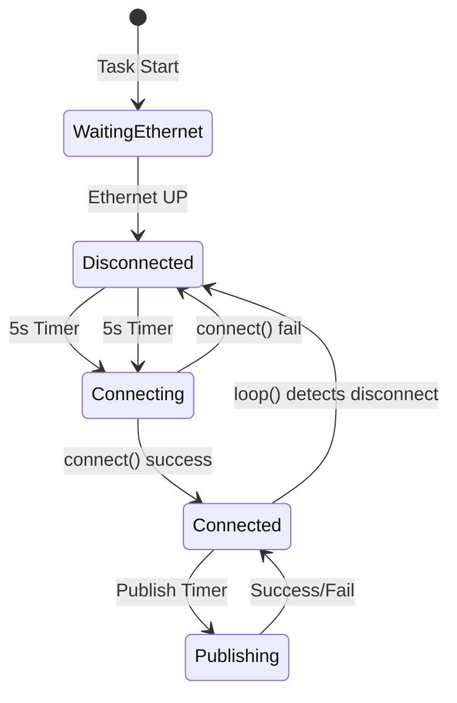
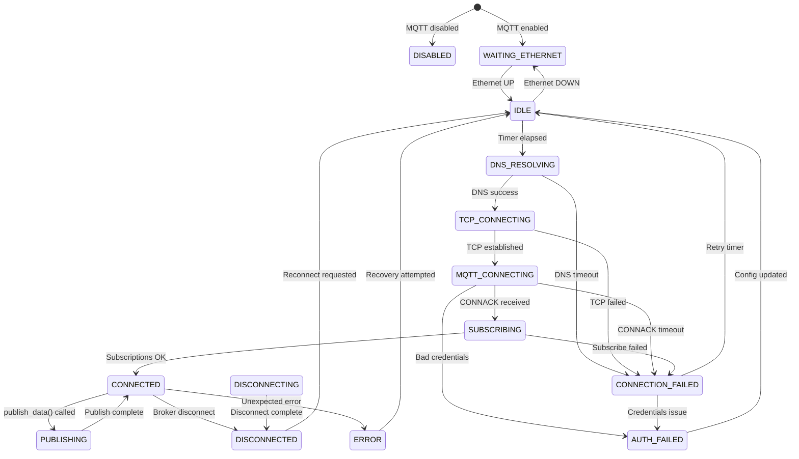

# MQTT State Machine Implementation Analysis
## Comprehensive Review for ESP-NOW Transmitter System

**Date**: February 12, 2026  
**Version**: 1.0  
**Scope**: Transmitter MQTT Implementation  
**Status**: ARCHITECTURAL RECOMMENDATION  

---

## Executive Summary

### Current State Analysis

The transmitter's MQTT implementation currently uses a **simple binary connected/disconnected model** without a formal state machine. While this works for basic operation, it has **critical limitations** that impact reliability and observability, especially during network transitions and error conditions.

**Key Finding**: ✅ **YES - MQTT should be implemented as a state machine**, but **NOT as urgently critical** as the ESP-NOW state machine. MQTT state machine provides **incremental improvements** to robustness and diagnostics rather than fixing fundamental architectural flaws.

### Priority Assessment

| Priority | System | Urgency | Impact | Justification |
|----------|--------|---------|--------|---------------|
| **CRITICAL** | ESP-NOW State Machine | Immediate | System Reliability | Fixes race conditions, channel locking failures |
| **HIGH** | MQTT State Machine | After ESP-NOW | Operational Excellence | Improves error handling, observability, recovery |
| **MEDIUM** | MQTT PSRAM Optimization | Long-term | Performance | Reduces memory pressure, increases buffer capacity |

**Recommendation**: Implement MQTT state machine **AFTER** ESP-NOW state machine is complete and stable. The ESP-NOW connection is the foundation - MQTT is a telemetry layer built on top.

---

## Current MQTT Implementation Analysis

### 1. Existing Architecture

**Location**: `ESPnowtransmitter2/src/network/`

**Components**:
```
mqtt_manager.h/cpp       → Connection management, publishing
mqtt_task.cpp            → FreeRTOS task, reconnection logic
mqtt_logger.h/cpp        → Logging subsystem (esp32common)
```

**Current State Tracking**:
```cpp
// mqtt_manager.h
volatile bool connected_{false};  // Binary state only

// mqtt_task.cpp
bool was_connected = false;       // Previous state tracking
unsigned long last_reconnect_attempt = 0;  // Timing
```

### 2. Current Operation Flow



**Current Logic** (from `mqtt_task.cpp`):
```cpp
while (true) {
    // Binary state check
    bool is_connected_now = MqttManager::instance().is_connected();
    
    if (!is_connected_now) {
        // Reconnection logic
        if (now - last_reconnect_attempt > 5000ms) {
            MqttManager::instance().connect();
        }
    } else {
        // Publishing logic
        MqttManager::instance().loop();
        if (now - last_publish > timing::MQTT_PUBLISH_INTERVAL_MS) {
            publish_data(...);
        }
    }
}
```

### 3. Identified Limitations

#### A. **No Intermediate States**
**Problem**: Binary connected/disconnected doesn't capture:
- Connection in progress (credentials being validated)
- DNS resolution phase
- TCP handshake phase
- MQTT CONNECT packet exchange
- Subscription registration phase

**Impact**:
- Cannot distinguish between "trying to connect" and "failed to connect"
- No visibility into WHERE connection failures occur
- Difficult to diagnose broker vs network vs credentials issues

#### B. **No Error Classification**
**Problem**: All failures treated identically
```cpp
if (success) {
    connected_ = true;
} else {
    LOG_ERROR("[MQTT] Connection failed, rc=%d", client_.state());
    connected_ = false;  // No state differentiation
}
```

**PubSubClient Return Codes** (currently ignored):
```cpp
#define MQTT_CONNECTION_TIMEOUT     -4  // Network issue
#define MQTT_CONNECTION_LOST        -3  // Broker disconnected us
#define MQTT_CONNECT_FAILED         -2  // TCP connection failed
#define MQTT_DISCONNECTED           -1  // Clean disconnect
#define MQTT_CONNECTED               0  // Success
#define MQTT_CONNECT_BAD_PROTOCOL    1  // Protocol mismatch
#define MQTT_CONNECT_BAD_CLIENT_ID   2  // Client ID rejected
#define MQTT_CONNECT_UNAVAILABLE     3  // Broker unavailable
#define MQTT_CONNECT_BAD_CREDENTIALS 4  // Auth failed
#define MQTT_CONNECT_UNAUTHORIZED    5  // ACL denied
```

**Impact**:
- Cannot implement smart backoff (e.g., longer retry for auth failures)
- No metrics on failure types
- Difficult to diagnose production issues

#### C. **No Graceful Degradation**
**Problem**: No "degraded operation" state
- When broker unavailable, logging is lost
- No local buffering strategy beyond MqttLogger's 20-message circular buffer
- No priority-based message handling

**Impact**:
- Critical alerts may be lost during outages
- No way to queue high-priority messages for retry
- Cannot distinguish "nice to have" telemetry from "must deliver" alerts

#### D. **Limited Observability**
**Problem**: No state transition logging
```cpp
// Current: Only logs after the fact
if (is_connected_now != was_connected) {
    VersionBeaconManager::instance().notify_mqtt_connected(is_connected_now);
    was_connected = is_connected_now;
}
```

**Missing**:
- When did state change occur?
- How long in each state?
- Why did state change (trigger)?
- Reconnection attempt counts

**Impact**:
- Difficult to diagnose intermittent connection issues
- No metrics for MQTT uptime/reliability
- Cannot detect connection flapping

---

## Proposed MQTT State Machine Architecture

### 1. State Definitions

**Recommended States**:

```cpp
enum class MqttState {
    // Initial states
    DISABLED,               // MQTT disabled in config
    WAITING_ETHERNET,       // Ethernet not ready
    
    // Connection states
    IDLE,                   // Ready to connect, waiting for timer
    DNS_RESOLVING,          // Resolving broker hostname (if applicable)
    TCP_CONNECTING,         // TCP connection in progress
    MQTT_CONNECTING,        // MQTT CONNECT packet sent, awaiting CONNACK
    SUBSCRIBING,            // Registering subscriptions
    
    // Operational states
    CONNECTED,              // Fully operational
    PUBLISHING,             // Publish in progress (for QoS tracking)
    
    // Error/recovery states
    CONNECTION_FAILED,      // Connection attempt failed (retryable)
    AUTH_FAILED,            // Authentication rejected (non-retryable)
    DISCONNECTING,          // Graceful disconnect in progress
    DISCONNECTED,           // Clean disconnection
    ERROR                   // Unrecoverable error
};
```

**State Count**: 14 states (vs 2 current binary states)

### 2. State Transition Diagram



### 3. State-Based Behavior Matrix

| State | Publish Allowed? | Subscribe Allowed? | Reconnect Strategy | Logger Buffering |
|-------|-----------------|-------------------|-------------------|------------------|
| **DISABLED** | ❌ No | ❌ No | Never | Buffer all (no send) |
| **WAITING_ETHERNET** | ❌ No | ❌ No | Wait for Ethernet | Buffer all |
| **IDLE** | ❌ No | ❌ No | Immediate attempt | Buffer all |
| **DNS_RESOLVING** | ❌ No | ❌ No | 10s timeout | Buffer all |
| **TCP_CONNECTING** | ❌ No | ❌ No | 15s timeout | Buffer all |
| **MQTT_CONNECTING** | ❌ No | ❌ No | 10s timeout | Buffer all |
| **SUBSCRIBING** | ⚠️ Queue | ❌ No | N/A | Buffer + send on connect |
| **CONNECTED** | ✅ Yes | ✅ Yes | N/A | Flush buffer, send live |
| **PUBLISHING** | ⚠️ Queue | ✅ Yes | N/A | Send live |
| **CONNECTION_FAILED** | ❌ No | ❌ No | Backoff (5s → 60s) | Buffer all |
| **AUTH_FAILED** | ❌ No | ❌ No | Manual retry only | Buffer all |
| **DISCONNECTING** | ❌ No | ❌ No | N/A | Buffer new |
| **DISCONNECTED** | ❌ No | ❌ No | 5s delay | Buffer all |
| **ERROR** | ❌ No | ❌ No | 30s delay | Buffer all |

### 4. Smart Reconnection Strategy

**Exponential Backoff Based on Failure Type**:

```cpp
struct ReconnectionPolicy {
    uint32_t base_interval_ms;     // Starting retry interval
    uint32_t max_interval_ms;      // Maximum retry interval
    float backoff_multiplier;      // Exponential growth rate
    uint32_t max_attempts;         // Give up after N attempts
};

// Different policies for different failure types
const ReconnectionPolicy NETWORK_FAILURE = {
    .base_interval_ms = 5000,      // 5s base
    .max_interval_ms = 60000,      // Max 60s
    .backoff_multiplier = 2.0,     // Double each time
    .max_attempts = 10             // Try 10 times
};

const ReconnectionPolicy AUTH_FAILURE = {
    .base_interval_ms = 300000,    // 5 minutes base
    .max_interval_ms = 3600000,    // Max 1 hour
    .backoff_multiplier = 1.0,     // No backoff
    .max_attempts = 3              // Try 3 times then give up
};

const ReconnectionPolicy BROKER_UNAVAILABLE = {
    .base_interval_ms = 10000,     // 10s base
    .max_interval_ms = 120000,     // Max 2 minutes
    .backoff_multiplier = 1.5,     // Gentle backoff
    .max_attempts = UINT32_MAX     // Never give up
};
```

**Current vs Proposed**:
```cpp
// CURRENT: Fixed 5s retry regardless of failure type
if (now - last_reconnect_attempt > 5000) {
    connect();
}

// PROPOSED: Smart backoff based on state
uint32_t retry_interval = get_retry_interval(current_state_, failure_type_);
if (now - last_reconnect_attempt > retry_interval) {
    transition_to(MqttState::IDLE);  // Triggers reconnect
}
```

---

## Implementation Specification

### 1. Class Structure

**New File**: `src/network/mqtt_state_machine.h`

```cpp
#pragma once
#include <Arduino.h>
#include <PubSubClient.h>

enum class MqttState {
    DISABLED, WAITING_ETHERNET, IDLE, DNS_RESOLVING,
    TCP_CONNECTING, MQTT_CONNECTING, SUBSCRIBING,
    CONNECTED, PUBLISHING, CONNECTION_FAILED,
    AUTH_FAILED, DISCONNECTING, DISCONNECTED, ERROR
};

enum class MqttFailureType {
    NONE,
    NETWORK_ERROR,      // DNS, TCP, timeout
    AUTH_ERROR,         // Bad credentials
    BROKER_ERROR,       // Broker unavailable/rejected
    PROTOCOL_ERROR      // Bad protocol, client ID
};

struct MqttMetrics {
    uint32_t total_connections{0};
    uint32_t failed_connections{0};
    uint32_t messages_published{0};
    uint32_t messages_failed{0};
    uint32_t reconnect_attempts{0};
    unsigned long last_connect_ms{0};
    unsigned long total_connected_ms{0};
    unsigned long current_connect_start_ms{0};
};

class MqttStateMachine {
public:
    static MqttStateMachine& instance();
    
    // State management
    void transition_to(MqttState new_state);
    MqttState get_state() const { return current_state_; }
    const char* get_state_name() const;
    
    // Event handlers
    void on_ethernet_connected();
    void on_ethernet_disconnected();
    void on_connect_success();
    void on_connect_failed(int mqtt_rc);
    void on_disconnect();
    void on_config_updated();
    
    // Publishing control
    bool can_publish() const;
    bool should_buffer() const;
    
    // Reconnection logic
    bool should_attempt_reconnect(unsigned long now) const;
    uint32_t get_retry_interval() const;
    
    // Metrics
    const MqttMetrics& get_metrics() const { return metrics_; }
    void log_state_transition();
    
private:
    MqttStateMachine() = default;
    
    void update_retry_interval();
    void reset_retry_backoff();
    
    MqttState current_state_{MqttState::WAITING_ETHERNET};
    MqttState previous_state_{MqttState::WAITING_ETHERNET};
    MqttFailureType last_failure_{MqttFailureType::NONE};
    
    unsigned long state_entered_ms_{0};
    unsigned long last_reconnect_attempt_ms_{0};
    uint32_t current_retry_interval_ms_{5000};
    uint32_t consecutive_failures_{0};
    
    MqttMetrics metrics_;
};
```

### 2. State Transition Implementation

**Pattern**: Event-driven transitions with validation

```cpp
void MqttStateMachine::transition_to(MqttState new_state) {
    // Validate transition (optional - can be strict or permissive)
    if (!is_valid_transition(current_state_, new_state)) {
        LOG_ERROR("[MQTT_SM] Invalid transition: %s → %s",
                  get_state_name(current_state_), get_state_name(new_state));
        return;
    }
    
    // Record transition
    previous_state_ = current_state_;
    current_state_ = new_state;
    state_entered_ms_ = millis();
    
    // Log transition with metrics
    unsigned long time_in_prev_state = state_entered_ms_ - previous_state_entered_ms_;
    LOG_INFO("[MQTT_SM] %s → %s (%lu ms in previous state)",
             get_state_name(previous_state_),
             get_state_name(current_state_),
             time_in_prev_state);
    
    // State-specific entry actions
    on_state_entered(new_state);
    
    // Update metrics
    if (new_state == MqttState::CONNECTED) {
        metrics_.total_connections++;
        metrics_.current_connect_start_ms = state_entered_ms_;
    }
    
    // Notify subsystems
    VersionBeaconManager::instance().notify_mqtt_state(new_state);
}
```

### 3. Integration with Existing Code

**Minimal Changes to MqttManager**:

```cpp
// mqtt_manager.h - Add state machine
class MqttManager {
public:
    // Existing methods unchanged
    bool connect();
    bool is_connected() const;
    void loop();
    
    // NEW: Get state machine
    MqttStateMachine& get_state_machine() { 
        return MqttStateMachine::instance(); 
    }
    
private:
    // Existing members
    WiFiClient eth_client_;
    PubSubClient client_;
    volatile bool connected_{false};  // Keep for compatibility
};

// mqtt_manager.cpp - Update connect()
bool MqttManager::connect() {
    auto& sm = MqttStateMachine::instance();
    
    if (!config::features::MQTT_ENABLED) {
        sm.transition_to(MqttState::DISABLED);
        return false;
    }
    
    if (!EthernetManager::instance().is_connected()) {
        sm.transition_to(MqttState::WAITING_ETHERNET);
        return false;
    }
    
    // Indicate connection attempt starting
    sm.transition_to(MqttState::MQTT_CONNECTING);
    
    LOG_INFO("[MQTT] Attempting connection to %s:%d...", 
             config::get_mqtt_config().server, 
             config::get_mqtt_config().port);
    
    bool success = false;
    if (strlen(config::get_mqtt_config().username) > 0) {
        success = client_.connect(
            config::get_mqtt_config().client_id,
            config::get_mqtt_config().username,
            config::get_mqtt_config().password
        );
    } else {
        success = client_.connect(config::get_mqtt_config().client_id);
    }
    
    if (success) {
        LOG_INFO("[MQTT] Connected to broker");
        connected_ = true;
        sm.on_connect_success();  // Transitions to SUBSCRIBING
        
        // Subscribe to topics
        if (client_.subscribe(config::get_mqtt_config().topics.ota)) {
            LOG_INFO("[MQTT] Subscribed to OTA topic");
            sm.transition_to(MqttState::CONNECTED);  // Fully operational
        } else {
            LOG_ERROR("[MQTT] Failed to subscribe");
            sm.transition_to(MqttState::CONNECTION_FAILED);
            return false;
        }
        
        client_.publish(config::get_mqtt_config().topics.status, "online", true);
    } else {
        int rc = client_.state();
        LOG_ERROR("[MQTT] Connection failed, rc=%d", rc);
        connected_ = false;
        sm.on_connect_failed(rc);  // Maps rc to state
    }
    
    return success;
}
```

**Updated Task Loop** (`mqtt_task.cpp`):

```cpp
void task_mqtt_loop(void* parameter) {
    auto& mqtt = MqttManager::instance();
    auto& sm = MqttStateMachine::instance();
    
    unsigned long last_publish = 0;
    bool logger_initialized = false;
    
    while (true) {
        unsigned long now = millis();
        MqttState current_state = sm.get_state();
        
        // Handle Ethernet state changes
        if (EthernetManager::instance().is_connected()) {
            if (current_state == MqttState::WAITING_ETHERNET) {
                sm.on_ethernet_connected();  // → IDLE
            }
        } else {
            if (current_state != MqttState::WAITING_ETHERNET && 
                current_state != MqttState::DISABLED) {
                sm.on_ethernet_disconnected();  // → WAITING_ETHERNET
            }
        }
        
        // State-based behavior
        switch (current_state) {
            case MqttState::IDLE:
                // Ready to connect - attempt immediately
                if (sm.should_attempt_reconnect(now)) {
                    mqtt.connect();
                }
                break;
                
            case MqttState::CONNECTION_FAILED:
                // Failed - use backoff strategy
                if (sm.should_attempt_reconnect(now)) {
                    sm.transition_to(MqttState::IDLE);  // Retry
                }
                break;
                
            case MqttState::CONNECTED:
                // Process MQTT
                mqtt.loop();
                
                // Initialize logger on first connect
                if (!logger_initialized) {
                    uint8_t level = EspnowMessageHandler::instance().load_debug_level();
                    MqttLogger::instance().init(mqtt.get_client(), "espnow/transmitter");
                    MqttLogger::instance().set_level((MqttLogLevel)level);
                    MqttLogger::instance().flush_buffer();
                    logger_initialized = true;
                }
                
                // Publish periodically
                if (now - last_publish > timing::MQTT_PUBLISH_INTERVAL_MS) {
                    last_publish = now;
                    char timestamp[64];
                    get_formatted_time(timestamp, sizeof(timestamp));
                    mqtt.publish_data(tx_data.soc, tx_data.power, timestamp,
                                     EthernetManager::instance().is_connected());
                }
                break;
                
            case MqttState::DISCONNECTED:
                // Clean disconnect - reconnect after delay
                if (sm.should_attempt_reconnect(now)) {
                    sm.transition_to(MqttState::IDLE);
                }
                break;
                
            case MqttState::AUTH_FAILED:
                // Auth failed - wait for manual config update
                LOG_ERROR("[MQTT] Waiting for configuration update (auth failed)");
                // Stay in this state until on_config_updated() called
                break;
                
            default:
                // Other states handled by transitions
                break;
        }
        
        vTaskDelay(pdMS_TO_TICKS(100));
    }
}
```

---

## Benefits Analysis

### 1. Improved Diagnostics

**Current**:
```
[MQTT] Connection failed, rc=-2
[MQTT] Connection failed, rc=-2
[MQTT] Connection failed, rc=-2
```
No context on why or how to fix.

**With State Machine**:
```
[MQTT_SM] IDLE → TCP_CONNECTING
[MQTT_SM] TCP_CONNECTING → CONNECTION_FAILED (network error, retry #1 in 5s)
[MQTT_SM] CONNECTION_FAILED → IDLE (after 5000ms backoff)
[MQTT_SM] IDLE → TCP_CONNECTING
[MQTT_SM] TCP_CONNECTING → CONNECTION_FAILED (network error, retry #2 in 10s)
[MQTT_SM] CONNECTION_FAILED → IDLE (after 10000ms backoff)
```
Clear state progression, failure classification, retry strategy visible.

### 2. Metrics & Observability

**New Metrics Available**:
```cpp
struct MqttMetrics {
    uint32_t total_connections;        // Lifetime connections
    uint32_t failed_connections;       // Failure count
    uint32_t messages_published;       // Total publishes
    uint32_t messages_failed;          // Failed publishes
    uint32_t reconnect_attempts;       // Retry count
    unsigned long total_connected_ms;  // Uptime
    
    // Calculated metrics
    float connection_success_rate() const {
        return (float)total_connections / 
               (total_connections + failed_connections);
    }
    
    float mqtt_uptime_percent() const {
        return (float)total_connected_ms / millis() * 100.0;
    }
};
```

**Export to Version Beacon**:
```cpp
beacon.mqtt_uptime_pct = sm.get_metrics().mqtt_uptime_percent();
beacon.mqtt_reconnects = sm.get_metrics().reconnect_attempts;
```

### 3. Smarter Error Handling

**Scenario**: Invalid credentials

**Current Behavior**:
```
[MQTT] Connection failed, rc=4  (bad credentials)
[5 seconds later]
[MQTT] Connection failed, rc=4  (bad credentials)
[Continues forever every 5 seconds, wasting resources]
```

**With State Machine**:
```
[MQTT_SM] MQTT_CONNECTING → AUTH_FAILED (bad credentials)
[MQTT_SM] Disabling automatic reconnect - manual intervention required
[MQTT] Publish diagnostic message to local log: "MQTT authentication failed - check credentials"
[Web UI shows: "MQTT Error: Invalid username/password - update in settings"]
[Stays in AUTH_FAILED until user updates config]
```

**Benefit**: Stops hammering broker with failed auth attempts, provides actionable feedback.

### 4. Graceful Degradation

**Priority-Based Buffering**:

```cpp
enum class MessagePriority {
    CRITICAL,   // System alerts, errors - MUST deliver
    HIGH,       // Important telemetry - should deliver
    NORMAL,     // Regular data - nice to have
    LOW         // Debug info - optional
};

class MqttLogger {
    void log(MqttLogLevel level, MessagePriority priority, 
             const char* tag, const char* format, ...) {
        if (sm.get_state() == MqttState::CONNECTED) {
            // Send immediately
            publish_message(...);
        } else {
            // Buffer based on priority
            if (priority >= MessagePriority::HIGH) {
                buffer_message(...);  // Save for retry
            } else {
                // Drop low-priority messages during outage
            }
        }
    }
};
```

**Benefit**: Critical alerts never lost, non-critical data shed during outages.

---

## Comparison with ESP-NOW State Machine

| Aspect | ESP-NOW State Machine | MQTT State Machine |
|--------|----------------------|-------------------|
| **Criticality** | ⚠️ **CRITICAL** | ✅ Important but not critical |
| **Impact if Missing** | System unreliable, data loss | Reduced diagnostics, inefficient retries |
| **Complexity** | High (17 states, channel hopping) | Medium (14 states, straightforward) |
| **Dependencies** | Core system functionality | Telemetry layer only |
| **Implementation Effort** | 2-3 weeks (transmitter + receiver) | 3-5 days (transmitter only) |
| **Testing Burden** | High (timing-critical, race conditions) | Medium (network error injection) |
| **Urgency** | Immediate (blocks reliability) | After ESP-NOW (incremental improvement) |

**Key Difference**: 
- **ESP-NOW state machine**: Fixes architectural design flaw (race conditions, channel locking)
- **MQTT state machine**: Adds operational polish (better diagnostics, smarter retries)

---

## Implementation Roadmap

### Phase 1: ESP-NOW State Machine (PRIORITY)
**Duration**: 2-3 weeks  
**Blocking Issue**: Must be completed first

**Tasks**:
1. Implement transmitter connection state machine (17 states)
2. Implement receiver connection state machine (10 states)
3. Add shared base classes to esp32common
4. Test channel discovery and locking
5. Validate ACK handshake reliability

### Phase 2: MQTT State Machine (AFTER ESP-NOW)
**Duration**: 3-5 days  
**Depends On**: Stable ESP-NOW connection

**Tasks**:
1. Create MqttStateMachine class (2 days)
   - Define 14 states
   - Implement transition logic
   - Add metrics tracking
2. Integrate with MqttManager (1 day)
   - Update connect() method
   - Add failure classification
   - Implement smart backoff
3. Update mqtt_task.cpp (1 day)
   - State-based loop logic
   - Ethernet state monitoring
   - Publish control
4. Testing (1 day)
   - Network error injection
   - Auth failure scenarios
   - Broker unavailable tests
   - Verify metrics accuracy

### Phase 3: MQTT PSRAM Optimization (LONG-TERM)
**Duration**: 1-2 weeks  
**Depends On**: MQTT state machine stable

**Tasks**:
1. PSRAM message buffering (see MQTT_PSRAM_OPTIMIZATION_REVIEW.md)
2. Large payload support
3. Outbox queue implementation

---

## Risks & Mitigation

### Risk 1: Over-Engineering
**Risk**: State machine adds complexity for minimal benefit  
**Likelihood**: Low  
**Mitigation**: 
- Keep implementation simple (no nested states, no complex validators)
- Focus on observability improvements
- Measure before/after metrics to validate value

### Risk 2: Regression Introduction
**Risk**: Breaking existing MQTT functionality  
**Likelihood**: Medium  
**Mitigation**:
- Keep existing `connected_` boolean for compatibility
- Implement state machine alongside current code initially
- A/B test with flag to enable/disable state machine
- Extensive testing before full switchover

### Risk 3: Timing Issues
**Risk**: State transitions interfere with PubSubClient timing  
**Likelihood**: Low  
**Mitigation**:
- State machine only tracks state, doesn't block operations
- PubSubClient loop() still called at same frequency
- Transitions happen between loop() calls

### Risk 4: Resource Overhead
**Risk**: State machine consumes too much RAM/CPU  
**Likelihood**: Very Low  
**Mitigation**:
- State machine is lightweight (enum + timestamps)
- Metrics struct is ~40 bytes
- Transition logic is simple comparisons
- Estimated overhead: <200 bytes RAM, <1% CPU

---

## Alternative Approaches Considered

### Alternative 1: Enhanced Boolean Flags
**Approach**: Add more boolean flags instead of state machine
```cpp
bool connecting_ = false;
bool auth_failed_ = false;
bool broker_unavailable_ = false;
```

**Rejected Because**:
- Doesn't scale (combinatorial explosion)
- Difficult to ensure mutual exclusivity
- No clear state transition logging
- Hard to add new states later

### Alternative 2: PubSubClient State Wrapper
**Approach**: Use PubSubClient's internal state enum directly

**Rejected Because**:
- PubSubClient states are limited (only CONNECTED/DISCONNECTED/error codes)
- No intermediate states during connection
- Cannot extend with custom states
- Cannot add reconnection logic to library

### Alternative 3: Separate Connection Manager
**Approach**: Create entirely new MQTT client abstraction

**Rejected Because**:
- Reinventing the wheel (PubSubClient is mature)
- Higher risk of bugs
- More maintenance burden
- State machine can wrap existing client

---

## Conclusion & Recommendations

### Summary of Findings

1. **Current MQTT implementation is functional** but lacks:
   - Detailed diagnostics during connection failures
   - Smart retry strategies based on failure type
   - Observability metrics for production monitoring
   - Graceful degradation during network issues

2. **State machine provides clear value** through:
   - Better error classification and handling
   - Improved diagnostics and troubleshooting
   - Metrics for monitoring MQTT health
   - Smarter reconnection logic

3. **Priority is correct**: ESP-NOW state machine is more critical
   - ESP-NOW failures cause data loss and system instability
   - MQTT failures only affect telemetry/monitoring
   - ESP-NOW must be solid foundation before adding MQTT polish

### Recommendations

#### Immediate (Next Sprint)
✅ **Implement ESP-NOW state machine first**
- Focus all effort on transmitter/receiver connection reliability
- Complete this before any MQTT work

#### Short-term (After ESP-NOW Complete)
✅ **Implement MQTT state machine**
- Low risk, high value for operational excellence
- Estimated 3-5 days of development
- Improves diagnostics significantly

#### Medium-term (After MQTT State Machine)
✅ **Add MQTT PSRAM optimization**
- Leverages state machine infrastructure
- Increases message buffering capacity
- See MQTT_PSRAM_OPTIMIZATION_REVIEW.md for details

#### Long-term (Future Enhancement)
⚠️ **Consider async MQTT library migration**
- Current PubSubClient is synchronous (blocking)
- Async libraries (e.g., esp-mqtt) provide better performance
- Only consider after state machine proves value
- Major refactor - needs strong justification

### Final Verdict

**YES, MQTT should be implemented as a state machine**, with the following caveats:

✅ **Do it AFTER ESP-NOW state machine**  
✅ **Keep implementation simple and focused**  
✅ **Prioritize observability over complexity**  
✅ **Measure metrics before and after to validate value**  
✅ **Use as learning exercise for state machine patterns**

The MQTT state machine is a **sound architectural improvement** that provides **real operational value** without significant risk or complexity. It's the right thing to do - just not the most urgent thing.

---

## References

1. **ESP-NOW State Machine Proposal**: `ESPNOW_STATE_MACHINE_PROPOSAL.md`
2. **MQTT PSRAM Optimization**: `MQTT_PSRAM_OPTIMIZATION_REVIEW.md`  
3. **PubSubClient Library**: https://github.com/knolleary/pubsubclient
4. **MQTT 3.1.1 Specification**: http://docs.oasis-open.org/mqtt/mqtt/v3.1.1/
5. **ESP-IDF MQTT Client** (async alternative): https://docs.espressif.com/projects/esp-idf/en/latest/esp32/api-reference/protocols/mqtt.html

---

**Document Version**: 1.0  
**Author**: GitHub Copilot (AI Assistant)  
**Review Status**: Ready for Technical Review  
**Next Review**: After ESP-NOW state machine implementation complete
