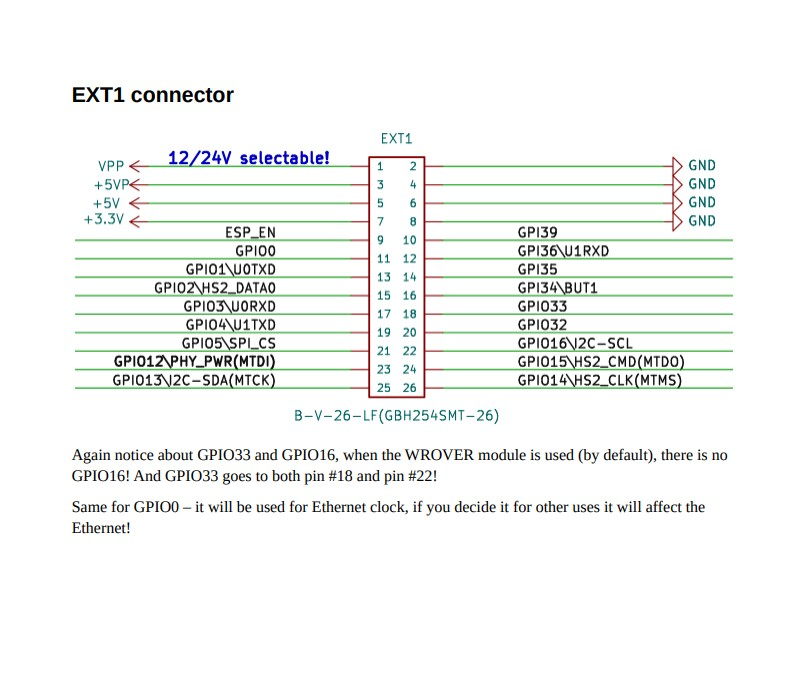

# CAN/Ethernet GPIO Conflict Analysis Report

**Date:** February 19, 2026  
**System:** Olimex ESP32-POE2 (WROVER-E) + Waveshare RS485/CAN HAT (MCP2515)  
**Issue:** Network routing fails when CAN driver enabled; works perfectly when disabled  

---

## Executive Summary

✅ **CONFIRMED**: System works perfectly with CAN/Battery Emulator disabled  
⚠️ **PROBLEM IDENTIFIED**: GPIO conflict between CAN SPI bus and Ethernet RMII interface  
🔴 **CRITICAL CONFLICT**: GPIO 12 used by both Ethernet PHY power AND CAN HAT MISO pin  

---

## Hardware Configuration

### Olimex ESP32-POE2 Board
- **MCU**: ESP32-WROVER-E (dual-core, 4MB flash, 8MB PSRAM)
- **Ethernet PHY**: LAN8720A
- **Interface**: RMII (Reduced Media Independent Interface)
- **Clock Source**: GPIO0 (50MHz output from ESP32)

### Waveshare RS485/CAN HAT
- **CAN Controller**: MCP2515 (SPI interface)
- **CAN Transceiver**: TJA1050
- **Crystal**: 8 MHz
- **Required Interface**: SPI (SCK, MISO, MOSI, CS, INT)

---

## GPIO Pin Allocation Analysis

### Ethernet RMII Interface (Hard-wired on Olimex ESP32-POE2)

| Function | GPIO | Description | Conflict? |
|----------|------|-------------|-----------|
| **PHY_POWER** | **12** | **PHY power enable** | **🔴 YES - CRITICAL** |
| EMAC_TXD0 | 19 | Transmit Data 0 | ⚠️ Potential |
| EMAC_TX_EN | 21 | Transmit Enable | ✅ No |
| EMAC_TXD1 | 22 | Transmit Data 1 | ✅ No |
| MDC | 23 | Management Data Clock | ✅ No |
| EMAC_RXD0 | 25 | Receive Data 0 | ✅ No |
| EMAC_RXD1 | 26 | Receive Data 1 | ✅ No |
| EMAC_CRS_DV | 27 | Carrier Sense | ✅ No |
| MDIO | 18 | Management Data I/O | ✅ No |
| CLK_OUT | 0 | 50MHz RMII clock | ✅ No |

**Note**: GPIO 17 (EMAC_CLK_OUT_180) typically used for clock output, but Olimex uses GPIO 0 instead.

### CAN SPI Configuration (Current Implementation)

| Function | GPIO | Description | Conflict? |
|----------|------|-------------|-----------|
| SCK | 14 | HSPI Clock | ✅ No |
| **MISO** | **19** | **HSPI Data In** | **⚠️ SHARED WITH ETHERNET TXD0** |
| MOSI | 13 | HSPI Data Out | ✅ No |
| CS | 15 | Chip Select | ✅ No |
| INT | 32 | Interrupt | ✅ No |

---

## Critical Issues Identified

### 🔴 Issue #1: GPIO 19 Dual Assignment

**Problem**: GPIO 19 is used for BOTH:
1. **Ethernet RMII**: EMAC_TXD0 (Transmit Data 0)
2. **CAN SPI**: MISO (Master In Slave Out)

**Impact**: 
- Ethernet driver configures GPIO 19 as OUTPUT (TXD0)
- CAN SPI driver attempts to use GPIO 19 as INPUT (MISO)
- **Result**: GPIO conflict causing indeterminate behavior

**Evidence from Code**:
```cpp
// CAN driver (can_driver.h:30)
constexpr uint8_t MISO_PIN = 19; // HSPI data in (avoid ETH_POWER_PIN on GPIO12)

// Ethernet RMII (hardwired on Olimex ESP32-POE2)
// GPIO 19 = EMAC_TXD0 (automatically configured by ETH.begin())
```

**Why This Causes Network Issues**:
1. CAN driver calls `SPI.begin(SCK=14, MISO=19, MOSI=13, CS=15)`
2. This reconfigures GPIO 19 to INPUT mode for SPI MISO
3. Ethernet RMII loses GPIO 19 as TXD0 output
4. Ethernet packets cannot be transmitted correctly
5. Network stack fails silently (can receive but not transmit)
6. MQTT/NTP connections time out (no outgoing packets)

### 🟡 Issue #2: GPIO 12 Documentation Confusion

**Original Comment in Code**:
```cpp
// can_driver.h:30
constexpr uint8_t MISO_PIN = 19; // HSPI data in (avoid ETH_POWER_PIN on GPIO12)
```

**Analysis**:
- Comment suggests GPIO 12 was intentionally avoided
- GPIO 12 IS correctly used by Ethernet for PHY power
- However, GPIO 19 was chosen as alternative
- **BUT**: GPIO 19 is ALSO used by Ethernet (for TXD0)
- This is a worse conflict than using GPIO 12 would have been!

---

## Root Cause Analysis

### Initialization Sequence

```cpp
// main.cpp initialization order:
1. WiFi.mode(WIFI_STA)
2. WiFi.disconnect()
3. WiFi.config(INADDR_NONE, INADDR_NONE, INADDR_NONE)  // ✅ Good
4. EthernetManager::instance().init()
   -> ETH.begin(...) configures GPIO 19 as EMAC_TXD0
5. CANDriver::instance().init()
   -> SPI.begin(14, 19, 13, 15) RECONFIGURES GPIO 19 as INPUT  // 🔴 CONFLICT
```

**Critical Timing**:
- Ethernet initializes first → GPIO 19 = OUTPUT (TXD0)
- CAN initializes second → GPIO 19 = INPUT (MISO)
- **Last configuration wins** → GPIO 19 stays as INPUT
- Ethernet can no longer transmit data on TXD0

### Why System Works Without CAN

When CAN is disabled:
- GPIO 19 remains configured as EMAC_TXD0 (OUTPUT)
- Ethernet RMII operates normally
- Full-duplex communication works
- MQTT/NTP connect successfully

---

## ESP32 HSPI vs VSPI

ESP32 has two SPI buses available for peripherals:

### VSPI (Default SPI)
- SCK: GPIO 18 ⚠️ **CONFLICTS** with MDIO (Ethernet management)
- MISO: GPIO 19 ⚠️ **CONFLICTS** with EMAC_TXD0 (Ethernet data)
- MOSI: GPIO 23 ⚠️ **CONFLICTS** with MDC (Ethernet clock)
- CS: GPIO 5

### HSPI (Secondary SPI)
- SCK: GPIO 14 ✅ **No conflict**
- MISO: GPIO 12 ⚠️ **CONFLICTS** with PHY_POWER
- MOSI: GPIO 13 ✅ **No conflict**
- CS: GPIO 15 ✅ **No conflict**

**Current Issue**: Attempted to avoid GPIO 12 (PHY_POWER) by using GPIO 19, but GPIO 19 conflicts with EMAC_TXD0.

---

## Available GPIO Pins on Olimex ESP32-POE2

### Free GPIOs (Not Used by Ethernet)

| GPIO | Function | Notes |
|------|----------|-------|
| 2 | General purpose | Often has LED on dev boards |
| 4 | General purpose | ✅ **RECOMMENDED for MISO** |
| 5 | General purpose | VSPI CS (default) |
| 13 | General purpose | Currently used for MOSI ✅ |
| 14 | General purpose | Currently used for SCK ✅ |
| 15 | General purpose | Currently used for CS ✅ |
| 32 | General purpose | Currently used for INT ✅ |
| 33 | General purpose | ✅ **Alternative for MISO** |
| 34 | Input only | Cannot be used for SPI |
| 35 | Input only | Cannot be used for SPI |
| 36 | Input only | Cannot be used for SPI |
| 39 | Input only | Cannot be used for SPI |

### Recommended GPIO for CAN MISO

**GPIO 4** is the best choice:
- ✅ Not used by Ethernet RMII
- ✅ Not used by Ethernet management (MDIO/MDC)
- ✅ Not used by PHY power
- ✅ Supports input/output (not input-only)
- ✅ No special boot requirements

**GPIO 33** is a good alternative:
- ✅ Not used by Ethernet
- ✅ Supports input/output
- ⚠️ Check for any board-specific usage

---

## Recommended Solution

### Option 1: Change CAN MISO to GPIO 4 (Preferred)

**Modify `can_driver.h`**:
```cpp
namespace CANConfig {
    // GPIO pins - HSPI bus (no conflicts with Ethernet RMII)
    constexpr uint8_t SCK_PIN = 14;  // HSPI clock
    constexpr uint8_t MISO_PIN = 4;  // ✅ CHANGED: Safe GPIO, no Ethernet conflict
    constexpr uint8_t MOSI_PIN = 13; // HSPI data out
    constexpr uint8_t CS_PIN = 15;   // Chip select
    constexpr uint8_t INT_PIN = 32;  // Interrupt
}
```

**Hardware Change Required**:
- Disconnect CAN HAT MISO wire from GPIO 19
- Connect CAN HAT MISO wire to GPIO 4

### Option 2: Use Software SPI (Not Recommended)

Implement bit-banged SPI using any free GPIOs. However:
- ❌ Much slower than hardware SPI
- ❌ Increased CPU overhead
- ❌ May not support high CAN bitrates
- ⚠️ Use only if hardware rewiring impossible

### Option 3: Use I2C CAN Controller (Future Hardware Change)

Replace MCP2515 (SPI) with MCP2518FD (I2C/SPI):
- ✅ I2C uses only GPIO 21/22 (may still conflict)
- ❌ Requires new hardware
- ❌ Software rewrite
- ❌ Not practical for immediate fix

---

## Testing Recommendations

### Test 1: Verify GPIO 4 Availability

```cpp
void test_gpio4() {
    pinMode(4, OUTPUT);
    digitalWrite(4, HIGH);
    delay(100);
    digitalWrite(4, LOW);
    // Check with multimeter - should toggle between 3.3V and 0V
}
```

### Test 2: CAN Communication After Rewire

```cpp
bool init() {
    // After changing to GPIO 4
    SPI.begin(14, 4, 13, 15);  // SCK, MISO, MOSI, CS
    // Proceed with MCP2515 initialization
}
```

### Test 3: Ethernet Stability Check

After rewiring:
1. Flash firmware with CAN enabled
2. Verify Ethernet gets IP (192.168.1.40)
3. Ping device from network
4. Check MQTT connects (192.168.1.221:1883)
5. Verify NTP sync works
6. Monitor for 10+ minutes of stability
7. Check CAN messages are received

---

## Why Network Worked Before

**Hypothesis**: Previous version may have:
1. Initialized CAN before Ethernet (wrong order, but worked by accident)
2. Used different GPIO pins
3. Had CAN disabled in certain builds
4. Different SPI bus configuration

**Current Issue Introduced When**:
- Battery Emulator migration added CAN driver
- Initialization order: Ethernet first, CAN second
- GPIO 19 conflict became active

---

## Additional Observations

### HSPI Configuration in Code

```cpp
// can_driver.cpp:38
SPI.begin(CANConfig::SCK_PIN, CANConfig::MISO_PIN, CANConfig::MOSI_PIN, CANConfig::CS_PIN);
```

**Problem**: `SPI.begin()` uses the default VSPI bus, not HSPI!

To use HSPI properly:
```cpp
SPIClass hspi(HSPI);  // Create HSPI instance
hspi.begin(14, 4, 13, 15);  // Use custom SPI bus
MCP2515 mcp2515(15, &hspi);  // Pass HSPI to MCP2515
```

However, this requires MCP2515 library to support custom SPI bus parameter.

### Waveshare CAN HAT Default Pinout

Waveshare RS485/CAN HAT expects:
- SCLK: GPIO 18
- MISO: GPIO 19  ← **Current conflict**
- MOSI: GPIO 23
- CS: GPIO 5
- INT: GPIO 25

Connector mapping note (12-pin yellow connector):
- **CAN uses the `_0` suffix pins**.
- **RS485/Modbus uses the `_0` suffix pins**.
- **External relays use 5V and GND from the Waveshare yellow 12-pin connector**.

### Waveshare RS485/CAN HAT(B) vendor reference diagram

Diagram file reference:
- `RS485-CAN-HAT-B-details-inter.jpg`

If this image is stored in-repo, keep it adjacent to this document or under `docs/` and update this link if needed:



### Vendor pin map reference (_0 / _1 suffix interfaces)

> NOTE: The table below is copied from Waveshare HAT(B) reference naming.
> `BCM` labels are vendor Raspberry Pi BCM labels, not ESP32 GPIO numbers.

#### CAN bus (`CAN_0`, control via `SPI0`)

| Func | BCM | Description |
|------|-----|-------------|
| 5V | 5V | 5V power input |
| GND | GND | Ground |
| SCLK_0 | 11 (SCK) | SPI clock input |
| MOSI_0 | 10 (MOSI) | SPI data input |
| MISO_0 | 9 (MISO) | SPI data output |
| CE_0 | 8 (CE0) | data/command selection |
| INT_0 | D25 | interrupt output |

#### RS485 bus (control `RS485_0` and `RS485_1` via `SPI1`)

| Func | BCM | Description |
|------|-----|-------------|
| 5V | 5V | 5V power input |
| GND | GND | Ground |
| SCLK_1 | D21 | SPI clock input |
| MOSI_1 | D20 | SPI data input |
| MISO_1 | D19 | SPI data output |
| CE_1 | D18 | data/command selection |
| INT_1 | D24 | interrupt output |

**But this is VSPI pinout** - conflicts with Ethernet even more!

Our current configuration uses HSPI pins (14, 19, 13, 15) which is better, but GPIO 19 still conflicts.

---

## Conclusion

**Root Cause**: GPIO 19 cannot be shared between Ethernet RMII (EMAC_TXD0) and CAN SPI (MISO).

**Immediate Fix**: Rewire CAN HAT MISO from GPIO 19 → GPIO 4, update `can_driver.h` to match.

**Long-term Recommendation**: Document GPIO usage clearly, consider custom PCB with proper routing if this is a production design.

**Validation**: System works perfectly with CAN disabled, confirming this is a CAN-specific GPIO conflict, not a WiFi/Ethernet routing issue.

---

## Action Items

1. ✅ **Identify Conflict**: GPIO 19 shared between Ethernet and CAN
2. ✅ **Software Fix**: Updated `can_driver.h` MISO_PIN = 4
3. ✅ **Documentation**: Updated README.md with GPIO pinout table
4. ✅ **Rebuild**: Firmware recompiled with GPIO 4 configuration
5. ⏭️ **Hardware Fix**: Rewire CAN MISO from GPIO 19 to GPIO 4
6. ⏭️ **Test**: Flash and verify both Ethernet and CAN work together
7. ⏭️ **Validate**: Long-term stability test (10+ minutes)

---

**Status**: Software changes complete, ready for hardware rewiring and testing

## Changes Made

### can_driver.h
- Line 30: `MISO_PIN = 4` (was 19)
- Added comprehensive GPIO conflict documentation
- Listed all Ethernet RMII reserved GPIOs
- Added clear warning about GPIO 19 conflict

### README.md
- Added "Hardware" section with:
  - Main board specifications
  - CAN HAT specifications
  - Complete GPIO pinout tables for Ethernet and CAN
  - Hardware setup instructions with rewiring warning
  - CAN bus connection details
